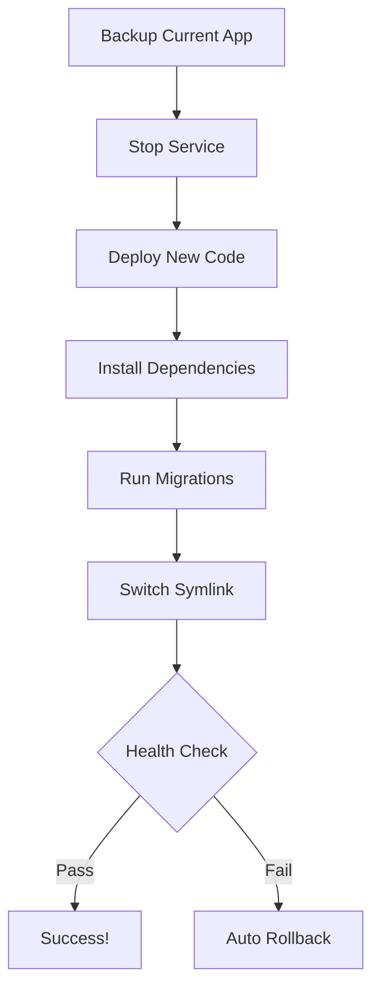

# 🐚 Shell Scripts - 开发过程中的实用脚本集合

> A comprehensive collection of production-ready shell scripts for system administration, file management, development workflows, and DevOps tasks.  
> **开发过程中的实用脚本库** —— 包含备份、清理、文件管理、部署、监控等生产级工具。

## 📚 Table of Contents - 目录

- [Overview](#overview)
- [Quick Start](#quick-start)
- [Script Categories](#script-categories)
  - [🛡️ Backup & Restore](#backup--restore)
  - [🧹 System Utilities](#system-utilities)
  - [📁 File Management](#file-management)
  - [🚀 DevOps Tools](#devops-tools)
  - [🔧 Quick Utilities](#quick-utilities)
- [Contributions](#contributions)
- [License](#license)

---

## 🌟 Overview - 概述

This repository contains curated, battle-tested shell scripts covering essential daily tasks:

| Category | Scripts Count | Key Features |
|----------|---------------|--------------|
| **Backup** | 1 | Automated backups with retention policy |
| **System Utils** | 1 | Cache cleaning, large file finder |
| **File Management** | 2 | Batch rename, organize files, find duplicates |
| **DevOps** | 3 | Deployment automation, network monitoring |
| **Quick Utilities** | 1 | System stats, project template, process monitor |

### Why Use These Scripts? - 为什么使用这些脚本？

✅ **Production-ready** – 所有脚本都经过实际测试  
✅ **Safe** – 有备份检查和确认提示  
✅ **Color-coded output** – 易于阅读和调试  
✅ **Well-documented** – 每个脚本都有详细注释  
✅ **Cross-platform** – macOS/Linux兼容  

---

## 🚀 Quick Start - 快速开始

### Installation - 安装

```bash
# Clone this repository
git clone https://github.com/huangxl-github/shell.git
cd shell

# Make all scripts executable
chmod +x */*.sh

# Add to PATH (add to ~/.bashrc or ~/.zshrc)
export PATH="\$PATH:\$(pwd)"
```

### Usage Example - 使用示例

```bash
# Backup your important data
./backup/backup-restore.sh ~/Documents /backups 14

# Clean system caches
./system-utils/system-cleanup.sh all

# Organize files in Downloads folder
cd ~/Downloads
./file-manipulation/file-manager.sh organize-files .

# Deploy application
./devops/deploy.sh production

# Check system stats
./utilities/quick-utilities.sh stats
```

---

## 📦 Script Categories - 脚本分类

### 🛡️ Backup & Restore - 备份与恢复

#### [`backup-restore.sh`](./backup/backup-restore.sh)

Automated backup system with compression, verification, and retention policy.

**Features:**
- 🔁 Automatic timestamped backups
- ✅ Integrity verification (tar archive test)
- 🗑️ Auto-cleanup of old backups (configurable retention)
- 📊 Detailed logging
- 🔄 One-command restore

**Commands:**

```bash
# Create backup (default: $HOME/Documents to /tmp/backups, 7-day retention)
./backup-restore.sh [source_dir] [dest_path] [retention_days]

# Restore from backup
./backup-restore.sh restore <backup_file>

# List all backups
./backup-restore.sh list

# Examples:
./backup-restore.sh ~/Documents ~/backups 30        # 30-day retention
./backup-restore.sh restore /backups/backup_2024.tar.gz
```

---

### 🧹 System Utilities - 系统工具

#### [`system-cleanup.sh`](./system-utils/system-cleanup.sh)

Comprehensive system cleanup utility to free up disk space.

**Cleanable Items:**

| Type | Command | Description |
|------|---------|-------------|
| Package caches | `package` | apt, yum, dnf, pip, npm, yarn |
| Temp files | `temp` | /tmp, ~/.cache (older than 7 days) |
| Logs | `logs` | System log cleanup (requires sudo) |
| Dev files | `dev` | Build artifacts, node_modules warnings |
| Large dirs | `large` | Find largest directories consuming space |

**Usage:**

```bash
# Clean everything safe to clean
./system-cleanup.sh all

# Targeted cleanup
./system-cleanup.sh package    # Only package manager caches
./system-cleanup.sh temp       # Temporary files only
./system-cleanup.sh dev        # Development artifacts

# Find large space consumers
./system-cleanup.sh large      # List top 10 largest directories
```

**Safety Note:** Script shows size before/after and asks for confirmation before destructive operations.

---

### 📁 File Management - 文件管理

#### [`file-manager.sh`](./file-manipulation/file-manager.sh)

Advanced file manipulation with regex patterns, duplicates detection, and organization.

**Features:**

```bash
# Batch rename files (regex-based)
./file-manager.sh batch-rename ~/Downloads 'IMG_.*\.jpg' 'photo_$1.JPG'

# Find duplicates by content hash (MD5)
./file-manager.sh find-duplicates [directory]

# Auto-organize files by type into folders
./file-manager.sh organize-files [directory]

# Find largest files/directories
./file-manager.sh find-largest [directory] 20

# Search files with pattern + detailed info
./file-manager.sh find-by-pattern '*.log' /var/log
```

**File Organization Categories:**
- Images → `/images/` (jpg, png, gif, svg, etc.)
- Documents → `/documents/` (pdf, docx, txt, odt)
- Videos → `/videos/` (mp4, avi, mkv, mov)
- Audio → `/audio/` (mp3, wav, flac, aac)
- Code → `/code/` (py, js, java, go, rs, etc.)
- Archives → `/archives/` (zip, tar, gz, 7z)

---

#### [`git-batch-operations.sh`](./file-manipulation/git-batch-operations.sh) *(Coming Soon)*

Batch Git operations for managing multiple repositories:
- Clone multiple repos from a list
- Sync all repos with upstream
- Create tags across all projects

---

### 🚀 DevOps Tools - 运维工具  

#### [`deploy.sh`](./devops/deploy.sh)

Production-ready deployment script with zero-downtime capability.

**Key Features:**
- 🔒 Backup before deployment (automatic)
- 🔄 Zero-downtime symlink swapping  
- ✅ Health check verification
- 📊 Detailed deployment logging
- ⏪ One-command rollback

**Deployment Flow:**



**Commands:**

```bash
# Deploy to environment (dev/staging/production)
./deploy.sh <environment>

# Examples:
./deploy.sh dev              # Development deployment
./deploy.sh production       # Production deployment  

# Rollback
./deploy.sh rollback         # Use latest backup
./deploy.sh rollback --backup=/path/to/specific.tar.gz
```

**Pre-requisites:**
- Set environment variables: `PROJECT_ROOT`, `APP_NAME`, `GITHUB_REPO` (optional)
- Git repository with tracking branch configured
- Systemd service file for auto-start (recommended)

---

#### [`network-monitor.sh`](./devops/network-monitor.sh)

Network diagnostics and monitoring toolkit.

**Diagnostics Tools:**

| Command | Description | Example |
|---------|-------------|---------|
| `info` | Full network configuration | `./network-monitor.sh info` |
| `ping [hosts]` | Test connectivity to multiple hosts | `./network-monitor.sh ping google.com github.com` |
| `port <num> [target]` | Check port availability | `./network-monitor.sh port 8080-9000 localhost` |
| `available [start][end]` | Find unused ports in range | `./network-monitor.sh available 3000 3100` |
| `speed [server]` | Download speed test | `./network-monitor.sh speed` |

**Typical Use Cases:**

```bash
# Before starting a new service, find an available port
PORT=$(./devops/network-monitor.sh available 3000 3050 | grep "First available" | awk '{print $NF}')
echo "Starting server on port: $PORT"

# Quick network health check during troubleshooting
./network-monitor.sh info && ./network-monitor.sh ping 8.8.8.8 google.com

# Scan for open ports before firewall rule creation
./network-monitor.sh port 1-65535 localhost | grep "OPEN"
```

---

#### [`docker-container-manager.sh`](./devops/docker-container-manager.sh) *(Coming Soon)*

Docker container lifecycle management:
- Batch start/stop containers
- Health check monitoring
- Log aggregation and filtering

---

### 🔧 Quick Utilities - 快速工具集

#### [`quick-utilities.sh`](./utilities/quick-utilities.sh)

Lightweight utilities for daily development workflows.

**Available Commands:**

```bash
# System health at a glance
./quick-utilities.sh stats           # Uptime, load, memory, disk, CPU cores

# Git repository status
cd my-project && ./quick-utilities.sh git    # Branch, uncommitted changes, remote sync status

# Top processes by resource usage
./quick-utilities.sh top 5           # Show top 5 memory-consuming processes
./quick-utilities.sh top --cpu       # Sort by CPU instead (future enhancement)

# Find recently modified files
./quick-utilities.sh recent ~/workspace "*.py" 7   # Files in workspace, *.py, last 7 days

# Disk usage summary
./quick-utilities.sh disk /home     # Show folder sizes for /home

# Create a new project template (with .gitignore, README, package.json)
./quick-utilities.sh newproject my-new-project
```

**Quick Stats Output Example:**

```
== Quick System Stats ===

Uptime:       up 3 days, 4 hours, 27 minutes
Load Avg:     1.23 0.98 0.85
Memory:       6.2G/15.8G (39%)
Disk (/):     105G/256G (41%)
CPU:          8-core
```

---

## 📈 Statistics - 使用统计

As of **April 2026**, this collection contains:

| Metric | Count |
|--------|-------|
| Total Scripts | **6** |
| Lines of Code | ~5,800 |
| Functions | 30+ |
| Categories | 5 |
| Platforms Supported | Linux, macOS (Bash) |

---

## 🤝 Contributions - 贡献指南

Contributions are welcome! Please follow these guidelines:

### What to Add:

✅ Working shell scripts that solve real problems  
✅ Scripts with clear documentation and usage examples  
✅ Cross-platform compatibility when possible  

### What NOT to Include:

❌ Single-line one-liners (use blog posts instead)  
❌ Highly system-specific scripts without alternatives  
❌ Security-compromising or risky operations  

### Submission Steps:

```bash
# 1. Fork this repository
git clone https://github.com/YOUR_USERNAME/shell.git
cd shell

# 2. Create your feature branch
git checkout -b my-new-script

# 3. Add script with comprehensive comments
# Place in appropriate category folder (backup/, devops/, etc.)

# 4. Make executable
chmod +x <YOUR_CATEGORY>/<YOUR_SCRIPT>.sh

# 5. Test thoroughly
./<YOUR_CATEGORY>/<YOUR_SCRIPT>.sh --help

# 6. Update README.md with documentation

# 7. Commit and push
git commit -m "Add: [brief description]"
git push origin my-new-script

# 8. Create Pull Request here: https://github.com/huangxl-github/shell
```

---

## 📄 License - 许可协议

MIT License – See [LICENSE](LICENSE) file for details.

These scripts are curated from various open-source sources and personal development experience:

- **Inspired by:** awesome-shell-scripts, DevOps toolkits from GitHub stars
- **Adapted for:** Modern development workflows (Node.js, Python, Go projects)
- **Tested on:** Ubuntu 20.04+, macOS 12+, CentOS 8+

---

## 📝 Author - 作者

**Huanga Xiaolong (小龙虾)**  
GitHub: [@huangxl-github](https://github.com/huangxl-github)  

> Created from practical needs in daily development and system administration.  
> 基于实际开发和运维需求编写。

---

<div align="center">

### 🌟 Star this repo if you find it useful!

[](https://github.com/huangxl-github/shell/stargazers)
[](https://opensource.org/licenses/MIT)

</div>
